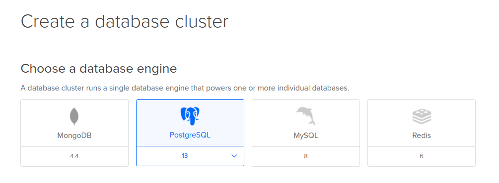

# Using Remote Database with reNgine

Related to [Github Issue](https://github.com/yogeshojha/rengine/issues/180)

If you plan to use remote database please follow the instructions. An example using DigitalOcean Managed database is below:

Please consider joining DigitalOcean using my [referral link](https://m.do.co/c/e353502d19fc) your profit is **$100** and I get $25 DO credit. This will help me test reNgine on VPS before I release any major features.

Please note that reNgine is tested and built on top of postgreSQL database. I can not guarantee if reNgine works with other database. If you gave it a try and did work, please let me know, I'll update this section.

**Please carry out these steps before installing reNgine**

Create a database cluster.

- Login to your digitalocean account and click on Databases on left navigation menu.


- Click on Create Database Cluster button.


- Choose PostgreSQL




- Click on Create Database Cluster button.


- Click on Get Started.


- Choose your inbound connection to the database cluster. This must be either VPS IP address or IP address of your local machine wherever reNgine is running.


- Note down your credentials, you'll need to put these details in .env file. Also, if your managed database only connects via SSL, please click on Download CA certificate.


- Finish the steps.


- Now you have a managed database cluster, and you need these credentials to put it in .env file.

**Sample .env file with managed database cluster credentials**

```
COMPOSE_PROJECT_NAME=rengine

AUTHORITY_NAME=reNgine
AUTHORITY_PASSWORD=nSrmNkwT
COMPANY=reNgine
DOMAIN_NAME=recon.example.com
COUNTRY_CODE=US
STATE=Georgia
CITY=Atlanta

POSTGRES_DB=defaultdb
POSTGRES_USER=doadmin
POSTGRES_PASSWORD=sfga69d121960is9cs9kc
POSTGRES_PORT=5432
POSTGRES_HOST=db-postgresql-nyc3-XXXXX-do-user-8362215-0.b.db.ondigitalocean.com

MIN_CONCURRENCY=5
MAX_CONCURRENCY=30
```

**That is all you need, You should now be able to connect to the database from reNgine, But, if you databases uses SSL connection, there is an extra step to be done.**

- Move your CA certificate to **reNgine's web root directory**

```
cd rengine/web && mv ~/Downloads/ca-certificate.crt .
```

- Open reNgine settings.py file inside rengine/web/reNgine

Find this line

```
DATABASES = {
    'default': {
        'ENGINE': 'django.db.backends.postgresql',
        'NAME': os.environ.get('POSTGRES_DB'),
        'USER': os.environ.get('POSTGRES_USER'),
        'PASSWORD': os.environ.get('POSTGRES_PASSWORD'),
        'HOST': os.environ.get('POSTGRES_HOST'),
        'PORT': os.environ.get('POSTGRES_PORT'),
        # 'OPTIONS':{
        #     'sslmode':'verify-full',
        #     'sslrootcert': os.path.join(BASE_DIR, 'ca-certificate.crt')
        # }
    }
}
```

and uncomment OPTIONS as below.

```
DATABASES = {
    'default': {
        'ENGINE': 'django.db.backends.postgresql',
        'NAME': os.environ.get('POSTGRES_DB'),
        'USER': os.environ.get('POSTGRES_USER'),
        'PASSWORD': os.environ.get('POSTGRES_PASSWORD'),
        'HOST': os.environ.get('POSTGRES_HOST'),
        'PORT': os.environ.get('POSTGRES_PORT'),
        'OPTIONS':{
            'sslmode':'verify-full',
            'sslrootcert': os.path.join(BASE_DIR, 'ca-certificate.crt')
        }
    }
}
```

Now you can continue with [Quick Installation](quick-install.md) or [Detailed Installation Instructions](install-win-mac.md)
