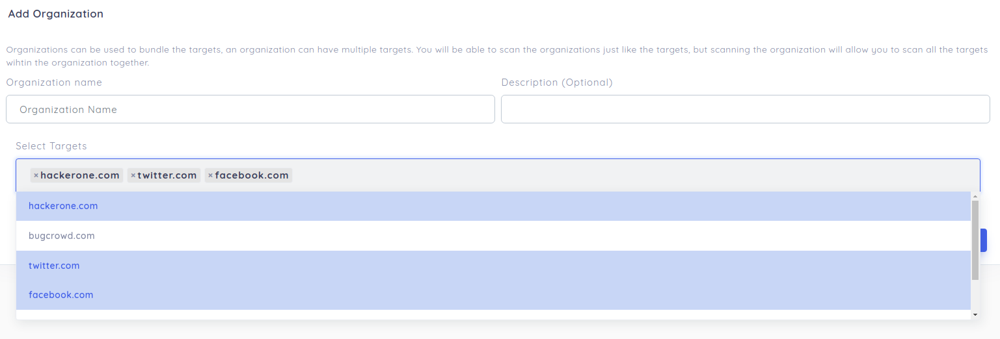

# Organization tagging on reNgine

reNgine supports tagging multiple targets to an organization. This allows you to initiate the scan for all targets at once, filter the scan results etc.

### Adding Organization

To add the Organization, navigate to the top navigation menu and click on **Organization** and then click on **Add Organization** button.

Name your organization, description is an optional parameter.

Choose as many targets as you need to add to the organization.

### Initiating Scan on Organization

You can also initiate the scan on organization. This means, the scan will be performed on all targets tagged to the organization.

### Scheduling Scan for an Organization

You can also schedule the scan on organization by clicking on the **Schedule Scan** button from Action column.

### Filtering Targets and Scan based on Organization

On both Scan History and Targets pages, you will find a **Filter button** on top left corner of the page. You can filter scans or targets based on organization.

