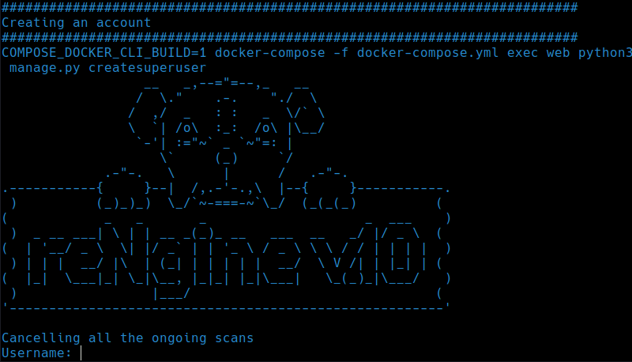

# Quick Install reNgine on Ubuntu

1. Clone reNgine

```
git clone https://github.com/yogeshojha/rengine && cd rengine
```

2. Edit the dotenv file, **please make sure to change the password for postgresql POSTGRES_PASSWORD !**

**Sample .env file**

```
COMPOSE_PROJECT_NAME=rengine

AUTHORITY_NAME=reNgine
AUTHORITY_PASSWORD=nSrmNkwT
COMPANY=reNgine
DOMAIN_NAME=recon.example.com
COUNTRY_CODE=US
STATE=Georgia
CITY=Atlanta

POSTGRES_DB=rengine
POSTGRES_USER=postgres
POSTGRES_PASSWORD=set_db_pass
POSTGRES_PORT=5432
POSTGRES_HOST=db

```
**Edit .env file**

```
nano .env
```

3. Run the installation script, Please keep an eye for any prompt, you will also be asked for username and password for reNgine.

```
sudo ./install.sh
```

if `./install.sh` does not have install permission, please change it, `chmod +x install.sh`

4. You will be asked to create account for reNgine, please choose a strong password.




**reNgine can now be accessed from [https://127.0.0.1](https://127.0.0.1) or if you're on the VPS https://your_vps_ip_address**
