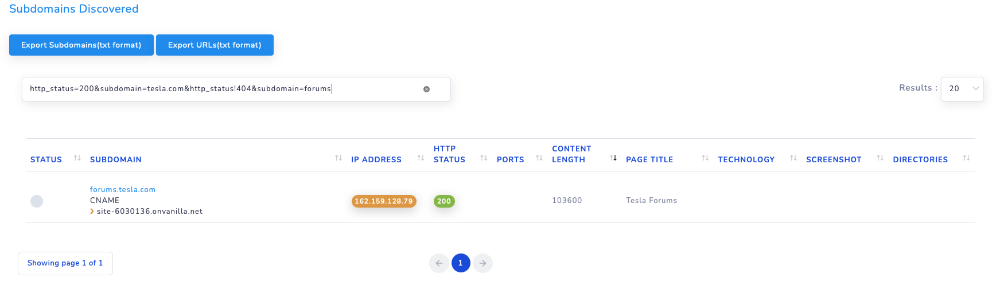

# Performing advanced search on recon data

I often get asked, how to filter the recon data, how to filter on specific columns. After the reNgine v0.5 update, this feature is available for subdomain data, vulnerability scan data and endpoints results. However, I am working on to make this available for global search as well, you might have to wait for sometime.

To perform any queries, you will need to know

1. What operations are supported?
2. What fields are supported?

## 1. What operations are supported?
reNgine currently supports

!!! info "Supported Query Operations"
    * **=** Equals, `field_lookup=value` this will work like contains in Python, **not the exact lookup!**
    * **<** Less Than `field_lookup<value` will return results lesser than the value from the lookup field, not all fields support `<`, field with integer values are supported, like http_status, content_length etc.
    * **>** (GT) `field_lookup>value` will return results greater than the value from the lookup field, not all fields support `>`, field with integer values are supported, like http_status, content_length etc.
    * **!** (NOT) `field_lookup!value` used to exclude the values.
    * **&** (AND) `field_lookup&value` used to perform intersection two of more results obtained from the operation of `<`, `>`, `=` or '!', performs AND operation on results.
    * **|** (OR) `field_lookup|value` used to perform union two of more results obtained from the operation of `<`, `>`, `=` or '!', performs OR operation on results.

### Examples

`http_status=200&subdomain=tequila`

You can combine these operators to perform an advanced query lookup. But...

!!! danger "Not Supported"
    **reNgine currently does not support & and |, both operators at the same time.
    You can either use combinations of & or combinations of |**
    For example

    `http_status=200&http_status=500&page_title=Google`

    **is supported.**

    But...

    `http_status=200&http_status=500|page_title=Google`

    **is not supported**

    Please perform only either `and` operations or `or` operations at a time, until next release.

## 2. What fields are supported?

### Supported fields in Subdomain Discovery Results

| Field Lookup | Description | Supported Operations                 |
| ----------- | ------------------------------------| ------------------------------------ |
| `subdomain`   | Subdomain Name    | =, !  |
| `cname`       |  CNAME Records | =, !  |
| `ports`       |  Open Ports| =, !  |
| `ip_address`  | IP Address | =, !  |
| `tech`        | Technology Used | =, !  |
| `http_status`  | HTTP status | =, !, <, >  |
| `content_length` | Content Length | =, !, <, >  |
| `status`        | Status of Subdomain, can be open or closed | =, !  |

!!! info "Possible options for status"
    The only possible options for status are, open or closed.

### Supported fields in Vulnerability Results

| Field Lookup| Description | Supported Operations                 |
| ----------- | | ------------------------------------ |
| `severity`       | Severity of Vulnerability | =, !  |
| `title`       | Title of Vulnerability | =, !  |
| `vulnerable_url` or `url`       | Vulnerable URL | =, !  |
| `description`      |  Description of vulnerability | =, !  |
| `status`       | Status of Subdomain, can be open or closed | =, !  |

### Supported fields in Endpoint Discovery Results

| Field Lookup| Description | Supported Operations                 |
| ----------- | | ------------------------------------ |
| `url` or `http_url`     | Endpoint URL  | =, !  |
| `http_status`      |  HTTP status | =, !, <, >  |
| `content_length`    |  Content Length | =, !, <, >  |
| `content_type`      |  Content Type | =, !  |

## Examples of valid advanced lookup

