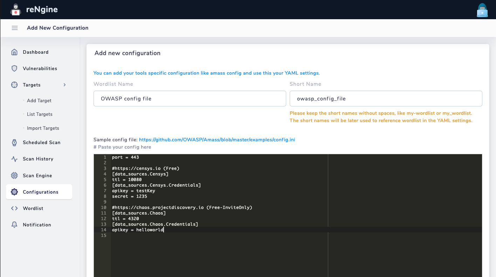
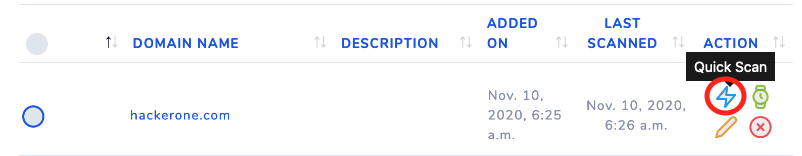

# Using reNgine

!!! info "About this document"
    This document will provide the detailed instructions on how to use reNgine. If you are looking for installation instructions and want to ensure if you have met the prerequisites, we suggest you to look at the [installation instructions](/pentester/install/) and [prerequisites](/pentester/install/#prerequisites) sections.

## Targets

**Target** could be a domain or a subdomain, that you can run the scan against. Having a target is a must and a basic requirement to run any scan.

!!! info ""
    Support for IP address as a target is coming soon.

### Adding Targets

To add the **Target**, navigate to the left sidebar menu and click on **Add Target** submenu. Using this option, you can add one target at a time, for importing multiple targets, follow the [Importing Targets](#importing-targets) guide.


### Importing Targets

reNgine provides the ability to import multiple targets. To import multiple targets, click on the **Import Targets** options from **Targets** menu.

!!! info "File extension support"
    reNgine currently supports importing targets only from .txt and .csv files.


#### Importing Targets from txt file

Please note that the txt file must only contain domain names or subdomain names. Any other format will be rejected by rengine.

!!! check "Supported txt Format"

    ```
    hackerone.com
    docs.hackerone.com
    nepal.gov.np
    ```

!!! danger "UnSupported txt Format"

    ```
    https://hackerone.com
    https://docs.hackerone.com
    nepal.gov.np/docs
    ```

#### Importing Targets from csv file

reNgine also provides an option to import targets from a csv file. The csv file contents must be in the form of

**domain/subdomain_name,Description**

!!! info ""
Having description is optional in csv format.

!!! check "Supported CSV Format"

    ```
    hackerone.com
    docs.hackerone.com, Hackerone Docs
    nepal.gov.np, Nepal Government Bug Bounty
    ```

!!! danger "UnSupported CSV Format"

    ```
    https://hackerone.com, Hackerone, Target
    https://docs.hackerone.com
    ```

## Configurations

Tools like [amass](https://github.com/OWASP/Amass) and [subfinder](https://github.com/projectdiscovery/subfinder) uses configuration files to unleash the power of these tools. These configuration files often contains API keys, and other configurations used to gather more accurate results. reNgine provides the ability to upload your configuration files for various tools and use them in the scan engines.

### Adding new Configurations

To add the **Configurations**, select the **Configurations** menu from left sidebar and click on **Add new Configuration**.



!!! example "Fields"
    * **Configuration Name**: The configuration name for you to identify.
    * **Short Name**: The short name is automatically generated, though you have an option to change it. The short name is an identifier to the config file, that will be used to reference in the **Scan Engine YAML Configuration**.
    * **Actual Configuration**: Paste your actual configuration.

!!! tip "TIP: Sample Configurations"
    If you have difficulty setting up the config file, you can find the sample config files below.

    * [Subfinder Configuration](https://github.com/projectdiscovery/subfinder/blob/master/README.md)
    * [Amass Configuration](https://github.com/OWASP/Amass/blob/master/examples/config.ini)

Using the config file in **Scan Engine** will be discussed in the [Setting up Scan Engine](#) section.

## Wordlist

Tools like [dirsearch](https://github.com/maurosoria) or amass uses wordlist to bruteforce the directories or subdomains. reNgine provides the ability to upload your own wordlists.

### Adding new Wordlist

To upload your **Wordlists**, selection the **Wordlists** menu from left sidebar and click on **Add new Wordlist**.


!!! example "Fields"
    * **Wordlist Name**: The Wordlist name for you to identify.
    * **Short Name**: The short name is automatically generated, though you have an option to change it. The short name is an identifier to the config file, that will be used to reference in the **Scan Engine YAML Configuration**.
    * Upload your wordlist in txt file format.

Using the wordlist in **Scan Engine** will be discussed in the [Setting up Scan Engine](#) section.

!!! tip "Common Wordlists"
    Some of the common wordlists for your scans.
    * [Seclists](https://github.com/danielmiessler/SecLists)
    * [Jason Haddix DNS Enumeration wordlist](https://gist.github.com/jhaddix/86a06c5dc309d08580a018c66354a056)
    * [Jason Haddix Content Discovery wordlist](https://gist.githubusercontent.com/jhaddix/b80ea67d85c13206125806f0828f4d10/raw/c81a34fe84731430741e0463eb6076129c20c4c0/content_discovery_all.txt)

!!! info "Default Wordlist"
    reNgine also has default wordlist called deepmagic top 5000 prefix, which can be referenced in scan engines using `wordlist: default`

## Scan Engines

One of the core components of **reNgine** is Scan Engine. Scan Engines lets you define the type of scan you wish to perform along with the ability to choose the tools, and dive deep into the configurations using the YAML configuration.

You can define as many scan engines as you want, with the type of configurations you wish. Scan Engines are capable of performing:

!!! example "reNgine Scan Engine capabilities"
    * **Subdomain Discovery**: Discovers all the subdomains using tools like sublist3r, subfinder, amass, assetfinder, etc.
    * **Port Scan**: Use to identify the open ports on the subdomains that have been discovered. Currently reNgine uses naabu to check for open ports. *We have plans to use masscan in the future.*
    * **Directory and File Search**: Uses `dirsearch` to discover the directories and files.
    * **Fetch all Endpoints**: Fetches all the urls for each subdomains from various sources like Open Threat Exchange, Wayback machine, common crawl etc. reNgine uses `gau`, `hakrawler` to fetch the endpoints.
    * **Vulnerability Scan** *(Beta)*: reNgine uses `nuclei` to perform the Vulnerability Scans on the targets.

### Default Engines in reNgine

!!! info "Default Scan Engines"
    reNgine comes with 3 preinstalled Scan Engines, namely `Full Scan`, `Passive Scan` and `Subdomain only scan`

!!! tip "Full Scan"
    This scan engine will perform all the capabilities of reNgine, namely Subdomain Discovery, Port Scan, Directory and File search, Fetch all endpoints, Vulnerability Scan. Running a Full Scan will take more time compared to other scans.

!!! tip "Passive Scan"
    This scan engine will perform only the `passive scan`, namely Subdomain Discovery, and will Fetch all endpoints. Active scanning like Port Scan, Directory and File Search is disabled. Also, no vulnerability scan will be performed.

!!! tip "Subdomain only scan"
    This scan engine will perform only the Subdomain Scan, all other capabilities are disabled.

### Defining new Scan Engines

To define a new Scan Engine in reNgine, click on **Scan Engine** menu from left sidebar and the click on **Add New Engine** button.


!!! example "Add new Scan Engine Fields"
    * **Engine Name**: Name of the Engine
    * Choose the type of scan you want this engine to perform.
    * **YAML Configuration**: YAML configuration for the scan engine. YAML configuration will help you choose the tools required to gather information and also focus on other configurations like defining number of threads, configurations, wordlists, etc.

YAML Setting for Scan Engine will be explained separately on [Guide to defining YAML configuration for scan engines](scan_engine.md) section.

## Initiating Scan

Initiating the scan in reNgine is pretty simple and straight forward process. If you've already defined the [Targets](#targets) and [Scan Engines](#scan-engines):

1. Click on **List Targets** sub menu under **Targets** menu.
2. You will see all the targets that you've added or imported. To initiate the quick scan click on the **Quick Scan** option from **Actions** column.

Click on the **Quick Scan** icon.
3. Choose the Scan Engine


Then click on **Start Scan** button.

To view the results, you can navigate to **Scan History** menu.

## Scan Status

reNgine has 4 different scan status.

!!! tip "Scan Status"
    * **Scanning**: The target is being currently scanned.
    * **Pending**: The target is currently on pending mode. reNgine can scan 4 targets in parallel, when there are more than 4 targets being scanned at a time, the 5th target goes into pending mode. Once the scan is completed, the 5th scan automatically goes into **Scanning** mode.
    * **Aborted**: The scan has been force stopped by the user.
    * **Failed**: The scan has been failed. Please [Check the Logs](install.md#checking-logs) as to why the scan has failed.

## Scheduling Scan

With the recent upgrade, reNgine can schedule the scan in the future as well, also scan be periodically scheduled as well. The two types of scans have been described below.

### Periodic Scan

reNgine provides the ability to periodically schedule the scan like, "I want to scan example.com every 10 minutes" or "I want to schedule the scan every 10 days". The recent upgrade provides the ability to do so.

#### Initiating periodic scan

### Clocked Scan

## Vulnerability Scan

## Notification
