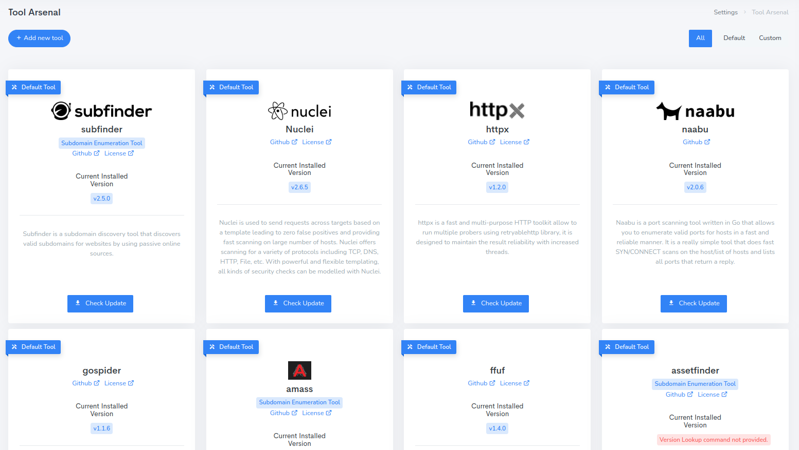
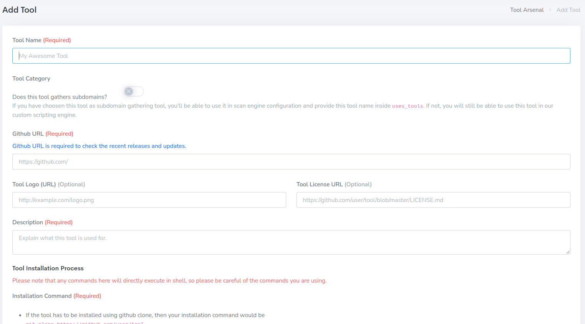

reNgine supports adding external subdomain discovery tools. Tools can be fetched from either Github or Go.

Click on Settings > Tools Arsenal Section. Arsenal Section is dedicated for external tools that reNgine uses. You can use this section to update the tools or add any external tools.

Click on `Add New Tool` button.

## Add tool Fields

- **Tool Name:** Your tool Name
- **Tool Category:** If your tool is a subdomain gathering tool, you need to choose this yes.
- **Github URL:** Tool Github URL
- **Tool Logo URL:** Tool Logo URL Ex. <https://toolname.com/logo.png>
- **Tool License URL:** Tool License URL Ex. <https://github.com/yogeshojha/rengine/blob/master/LICENSE>
- **Description:** Tool Description, what this tool does.
- **Installation Command:** Installation commands such as `git clone` or `curl` or `pip` or `go get`.

  If the tool has to be installed using github clone, then your installation command would be

  `git clone https://github.com/user/tool`

  If the tool has to be installed using go, the your installation command would be

  `go install -v github.com/tool@latest`

  !!! danger
  Please note that, `go get` command is no longer supported by go. Instead you should use go install. [Learn why!](https://go.dev/doc/go-get-install-deprecation)

- **Update Command:** Update command for the tool.

      If the tool was installed using git clone, it is recommended to use <code>git pull</code> for updating.

      If the tool was installed using go, it is recommended to use the same command as go install.

      If the tool has any other update command, you can also use them here.

- **Version Lookup Command:** This will be used for determining the current version and compare with the latest version and to notify if any tool update is available.

      Examples include

      - `python3 tool.py -v`
      - `tool -v`
      - `tool --version`

- **Version Match Regex:**

  reNgine needs version match regex to find out if there is any update available or not. You can check how the tool displays the version number and we can generate the regex for you, or you can do that manually as well.
  If version regex is not given, reNgine will not be able to check the updates automatically. However, you can still force update the tools.

  See, how the tool names the release version. <https://github.com/user/tool/releases>

  - For version numbers like `v1.2/V1.2/1.2` use regex `[vV]*(d+.)?(d+.)`
  - For version numbers like `v1.2.3/V1.2.3/1.2.3` use regex `[vV]*(d+.)?(d+.)?(*|d+)`
  - For version numbers like `v1.2.3.4/V1.2.3.4/1.2.3.4` use regex `[vV]*(d+.)?(d+.)?(*|d+)?(*|d+)`

- **Subdomain Gathering Command:**
  reNgine needs to know how this tool accepts target and output the subdomain results.

  Use the below syntax wherever required.

  - {PATH}, Use this if your tool is github cloned. Example. python3 {PATH}/subdomain.py
  - {TARGET}, Use this for the command-line arg that takes in domain as input target. Example. subfinder -d {TARGET}
  - {OUTPUT}, Use this for the command-line arg that takes the output arg. Example. subfinder -d {TARGET} -o {OUTPUT}
  - {PROXY}, Use this if your tool supports proxy. Example. tool_name -p {PROXY}

  You can use the combinations of the above syntax and also you can use any other command-line argument that your tool supports.

To use this tool, simply use this toolname on Scan Engine `uses_tools` section.
