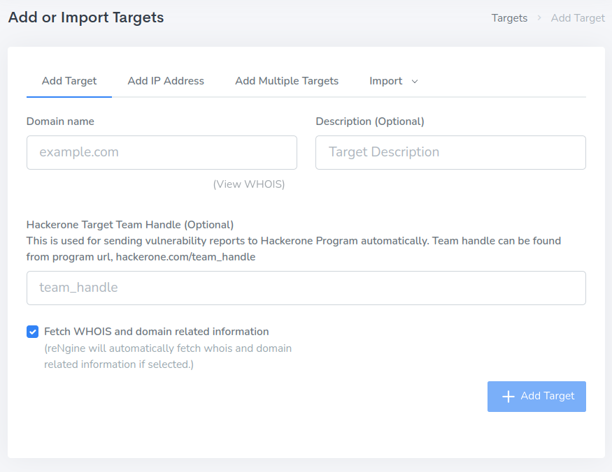

# Automatic Vulnerability Reporting to Hackerone

reNgine automatically sends vulnerability report to the Hackerone program which the target belongs to, if it finds Critical or High vulnerability.

In order for reNgine to achieve this, it needs 3 things.

- Your HackerOne Username
- Hackerone API Token
- And Target team_handle

## How to generate hackerone api token?

To generate hackerone api token, visit the official documentation/instructions from Hackerone. [https://docs.hackerone.com/hackers/api-token.html](https://docs.hackerone.com/hackers/api-token.html)

Once you have generated your hackerone api token, you can add them to Hackerone Setting, under Settings menu from top navigation bar.

## What is team_handle?

Team handle is a unique identifier for your target generated by hackerone. Suppose if your target belongs to a vulnerability program called 'Stripe', the target team_handle will be the 'stripe' generated from https://hackerone.com/stripe.

You need to add the team_handle to your target when you add, you can also update the target later.

[How to add team_handle to your target?](/usage/targets/#what-is-team-handle)

!!! danger
    team_handle must be provided to the targets for reNgine to automatically report vulnerability.

## Testing yout hackerone api token

You can also test hackerone api token to see if it works correctly. Once you have generated api token, you can verify by clicking on the button "Test my hackerone api key".

## Choosing the vulnerability severity to report

By default, reNgine will report only Critical and High severity Vulnerabilities. You can choose to select what severity to report among Critical, High and Medium Severities.

# Vulnerability Report Template

You can customize the vulnerability report template using markdown. Replace the below syntax wherever you require. Curly braces are must!

* `{vulnerability_name}` Vulnerability Title/Name.
* `{vulnerable_url}` Vulnerable URL.
* `{vulnerability_severity}` Vulnerability Severity.
* `{vulnerability_description}` Description of vulnerability generated by Nuclei.
* `{vulnerability_extracted_results}` Vulnerabty Results extracted by Nuclei.
* `{vulnerability_reference}` Additional Reference to vulnerability.

