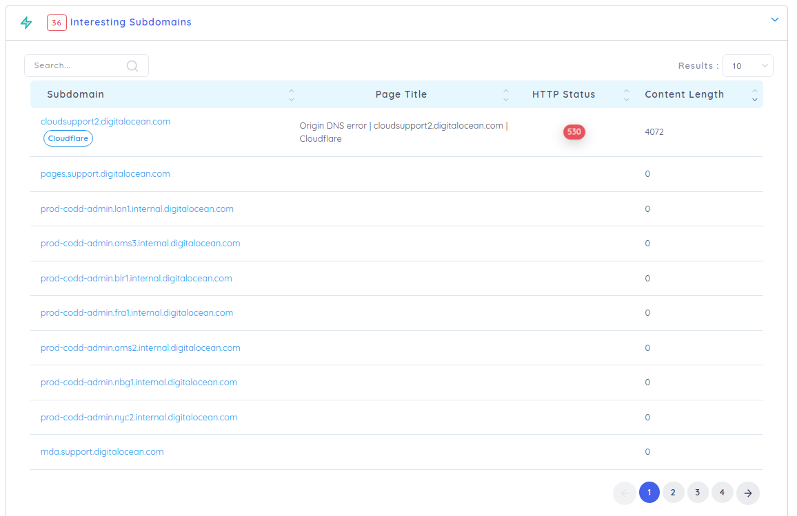
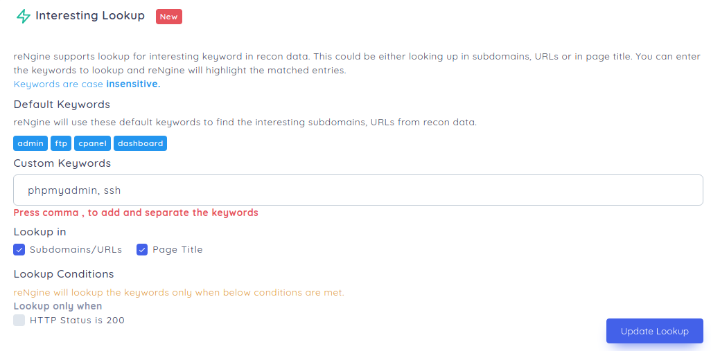

# Interesting Subdomains

reNgine can identify interesting subdomains based on certain keywords. While some of the keywords come by default, you also have an option to enter custom keywords, that are likely to be your interest.

## Adding keywords

On the top navigation menu, click on Engine and then click on Interesting Lookup. You can now add interesting keywords on **custom keywords** section.

**Please separate keywords using comma**

!!! check "Example"
    phpmyadmin, ssh, another keyword

If any of these keywords are matched, reNgine will classify them as interesting subdomains. You can also choose where to lookup, **Subdomain Name** or **Page Title** or both.

You can also choose to lookup only if subdomain HTTP status is 200, OK.
