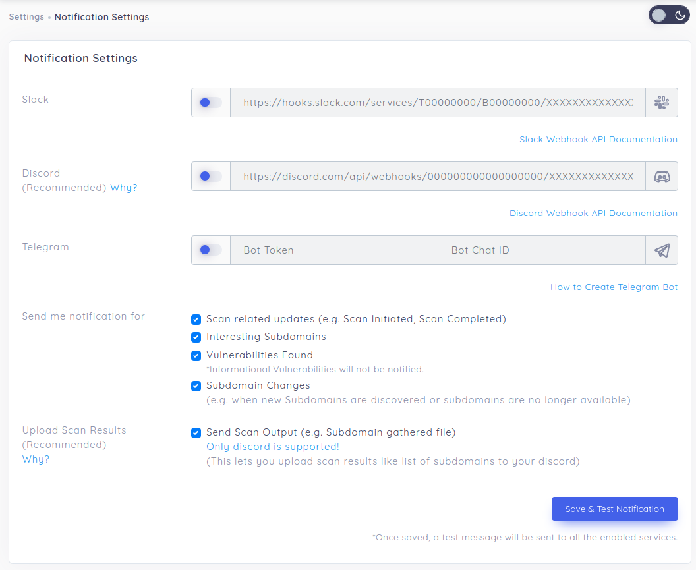

# Notification Settings

reNgine now supports Slack, Discord and Telegram as notification channels. You can now choose what kind of notification to be sent to the notification channel.

Notifications settings can be found inside Notification Settings section under Settings menu in top navigation bar.

* [Learn how to create Slack Web Hook](https://api.slack.com/messaging/webhooks)
* [Learn how to create Discord Web Hook](https://support.discord.com/hc/en-us/articles/228383668-Intro-to-Webhooks)
* [Learn how to create Telegram Bot](https://medium.com/shibinco/create-a-telegram-bot-using-botfather-and-get-the-api-token-900ba00e0f39)

You can also send list of all subdomains to discord by setting the the checkbox 'Upload Scan results' to true.
