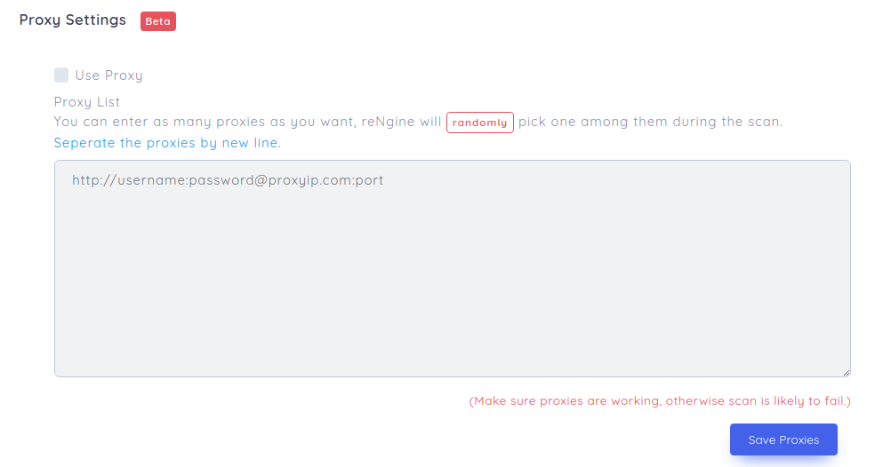

# Proxy Settings

Proxies are integral part of web scraping. Every website has a limit to certain number of requests for a certain period of time from an particular IP Address that it will allow, exceeding the limit will block any incoming requests from such IP Address for a specific period of time. This results in unreiliable recon results. Suppose if you were to run Nuclei on a particular target with all the templates, your IP is likely to get banned.
And this is especially true for dorking and other OSINT reNgine does. After certain dorking attempts Google is likely to ban your IP for certain period of time.

If you are looking for highly accurate recon results, it is recommended that you use rotating proxies or proxy pool.

reNgine allows you to add as many proxies as possible, while during the scan, reNgine will pick one proxy randomly. There is no order to which a proxy will be selected.

## Purchasing Proxies

If you are looking to purchase Proxies, please use [this referral](https://app.privateproxy.me/from/27103) link to purchase. Or you can also use coupon `rengine` here on [PrivateProxy](https://privateproxy.me/), using coupon `rengine`, you'll get additional 25% off.

## Adding Proxies

To add proxies, click 'Settings' on top navigation menu, and then click on 'Proxies'

Click on 'Use Proxy' checkbox and the textarea should be visible. Enter as many proxies as possible and click on 'Save Proxies' button. You are now good to go.

!!! danger
    Please make sure your proxies are working, otherwise reNgine will not be able to perform scan.
