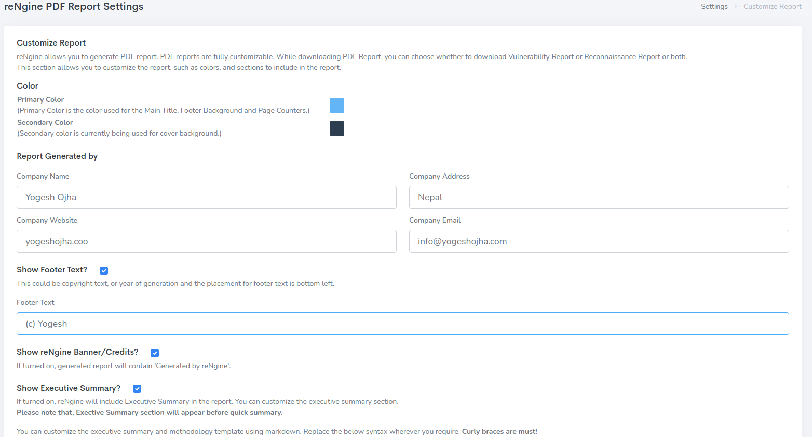
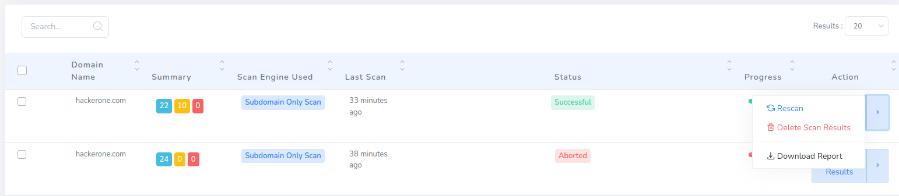
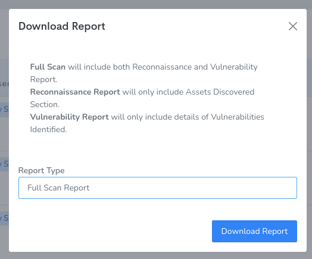

reNgine supports downloading PDF reports. You can either download `Full Scan Report` or `Reconnaissance Report` or `Vulnerability Report`.

You can also customize the vulnerability report from Settings > Report Settings.

To Download the report click on Scan History and on Action Button Click `Download Report`

Select the type of report and click on `Download Report`

