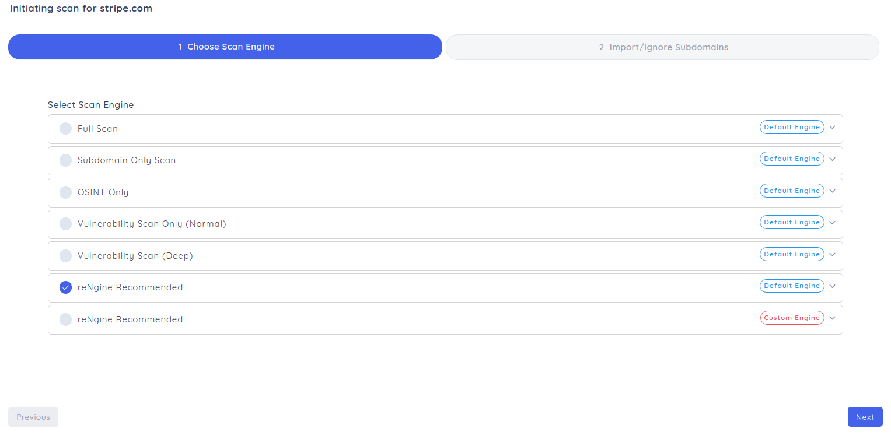
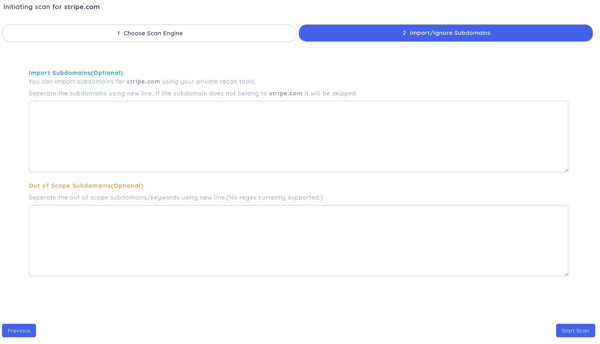

# Scanning the Targets

Once you have added the targets, you can perform the scan on the targets. Scan can be of two types:

- [Quick Scan](#quick-scan) aka Immediate Scan

- [Schedule Scan](#schedule-scan)
    - [Periodic Scan](#periodic-scan)
    - [Clocked Scan ](#clocked-scan)

Initiating the scan in reNgine is pretty simple and straight forward process. If you've already defined the [Targets](../targets) and [Scan Engines](../scan_engine/index.md):

### Quick Scan

Quick Scan can be used to perform immediate scan on the targets. Once you are on the targets section, click on Quick Scan icon denoted by lightening symbol.

You'll now be asked to choose scan engine.

Choose your preferred scan engine and clck Next.

#### Importing Subdomains

If you have your own recon methodology for gathering subdomains, you can now import them directly into reNgine.

You can paste subdomains into the **Import Subdomains** text area.

#### Out of Scope Subdomains

If you wish to skip any subdomains, you can insert those subdomains here . reNgine will not perform any scans on those subdomains.

You can paste subdomains into the **Out of Subdomains** text area.

### Schedule Scan

With the recent upgrade, you can schedule the scan in the future. The two types of scheduled scans are:

#### Periodic Scan

reNgine provides the ability to periodically schedule the scan like, "I want to scan example.com every 10 minutes" or "I want to schedule the scan every 10 days".

!!! info "Periodic scan will allow you to schedule the scan every X"
    * Minutes
    * Hours
    * Days
    * Weeks
    * Months

#### Clocked Scan

Clocked scan are different than Periodic Scan. In clocked scan, you can schedule the scan at a specific time. Like, "I want to schedule the scan at 3 pm 26th August 2021."

!!! warning ""
    **Clocked Scan are one time task.**

### Scan Status
reNgine has 5 different scan status.

!!! tip "Scan Status"
    * **Successful**: The target is successfully scanned.
    * **Scanning**: The target is being currently scanned.
    * **Pending**: The target is currently on pending mode. reNgine can scans targets in parallel, suppose when there are more than 4 targets being scanned at a time, the 5th target goes into pending mode. Once the scan is completed, the 5th scan automatically goes into **Scanning** mode.
    * **Aborted**: The scan has been force stopped by the user.
    * **Failed**: The scan has been failed.
