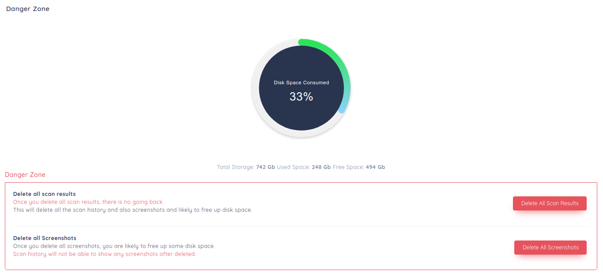

# reNgine settings

reNgine allows you to cleanup your scan results or just delete all the screenshots. This is because, most of us run reNgine on VPS and are limited by storage space.

Click on Settings menu on top navigation bar and click on reNgine settings menu.

!!! danger
    Please note that these actions are irreversible.

You have two options here,

* Delete all scan results

    This will delete all the scan history and also screenshots and likely to free up disk space.

* Delete all Screenshots

    Once you delete all screenshots, you are likely to free up some disk space.
    Scan history will not be able to show any screenshots after deleted.
