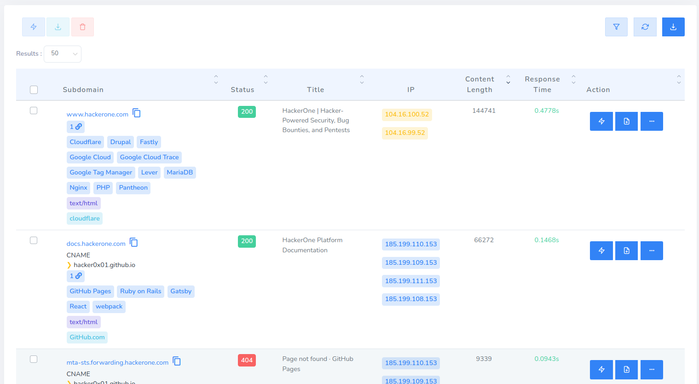
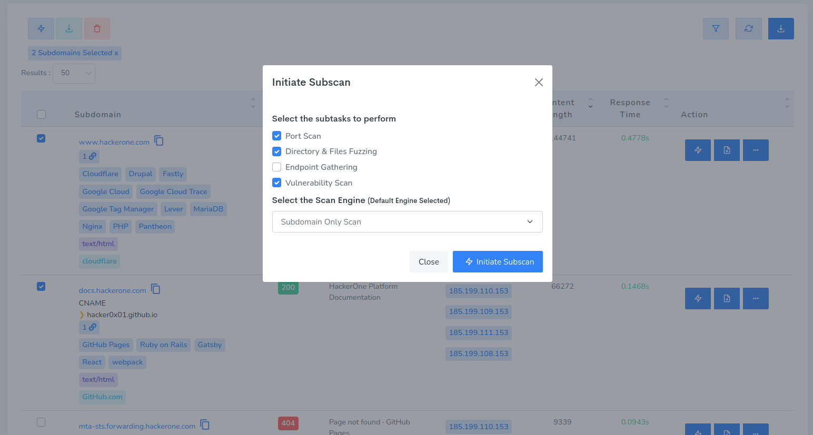

reNgine 1.1 introduced yet another game changing feature called SubScan. SubScan allows you to perform additional scans on Subdomains that are discovered.

To perform SubScan you can simply select one or more subdomains and click on `⚡ Initiate Further Scan` button. Look for ⚡ button.

Choose the subtasks to perform. You can choose one or more subtasks

Click on Initiate Subscan.

Once subscan is completed you can check the subscan results by simply clicking on each subscans.
