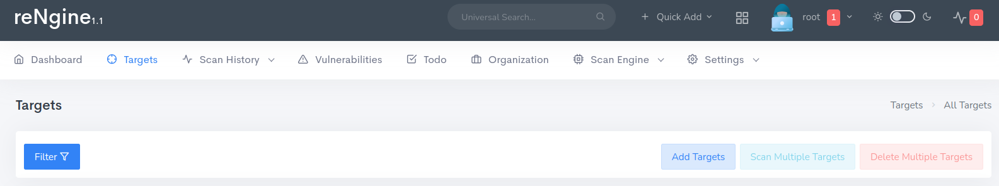
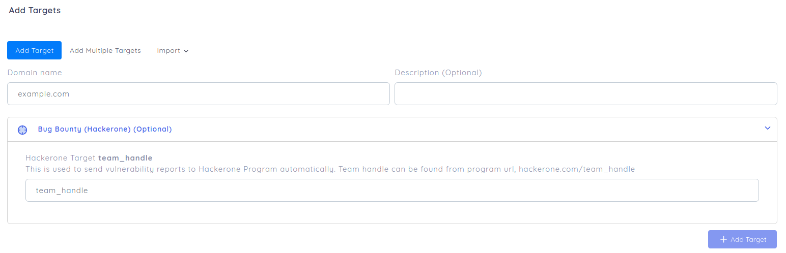
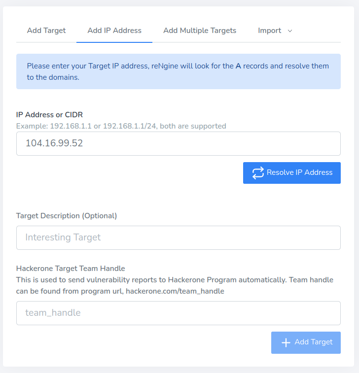
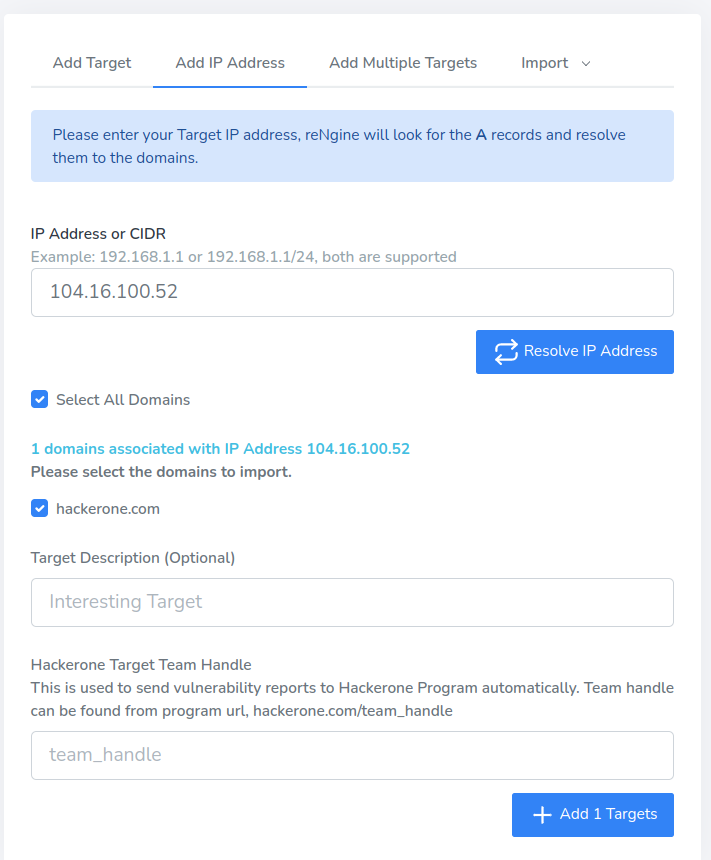
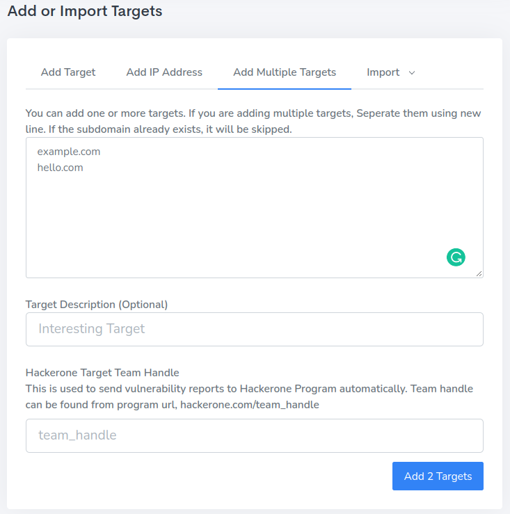

# Targets in reNgine

**Target** could be a domain or a subdomain, that you wish to perform recon. Having a target is a must and a basic requirement to run any scan.

To add the **Target**, navigate to the top navigation menu and click on **Targets**.



Too add the targets click on **Add Targets** button.

You have 3 options to add the Targets,

- [Adding Individual targets](#adding-individual-targets)
- [Resolve Domains from IP or CIDRs](#resolve-domain-from-ip-or-cidrs)
- [Adding Multiple targets](#adding-multiple-targets)
- [Import via Files](#import-via-targets)

### Adding Individual Targets

This allows you to add single Individual targets.




## What is team handle?

!!! danger "What is team_handle?"
    Team handle is used to automatically report vulnerability to a program on hackerone. This is the identifier of the program.
    Also can be identified by the URL hackerone.com/team_handle, **Use this only if you want to report the vulnerability to Hackerone.** [More information on how to use automatic vulnerability reporting can be found here.](hackerone.md)


## Resolve Domains from IP or CIDRs

If you have a IP address and wish to import domain from, you can do so via Add IP Address section.

Enter the IP and click on Resolve IP Address button.



reNgine will attempt to resolve the IP Address. Click on the checkboxes for all the domains you wish to import.



## Adding Multiple Targets

This feature allows you to add multiple targets at once. But remember that the description and team_handle, if used, will be applied to all the targets.




## Importing Targets

reNgine provides the ability to import multiple targets.

!!! info "File extension support"
    reNgine currently supports importing targets only from **.txt** and **.csv** files.

### Importing Targets from txt file

Please note that the txt file must only contain domain names or subdomain names. Any other format will be rejected by rengine.

!!! check "Supported txt Format"

    ```
    hackerone.com
    docs.hackerone.com
    example.com
    ```

!!! danger "UnSupported txt Format"

    ```
    https://hackerone.com
    https://docs.hackerone.com
    example.com/docs
    ```

### Importing Targets from csv file

reNgine also provides an option to import targets from a csv file. The csv file contents must be in the form of

**domain/subdomain_name,Description**

!!! info ""
Having description is optional in csv format.

!!! check "Supported CSV Format"

    ```
    hackerone.com
    docs.hackerone.com, Hackerone Docs
    nepal.gov.np, Nepal Government Bug Bounty
    ```

!!! danger "UnSupported CSV Format"

    ```
    https://hackerone.com, Hackerone, Target
    https://docs.hackerone.com
    ```
