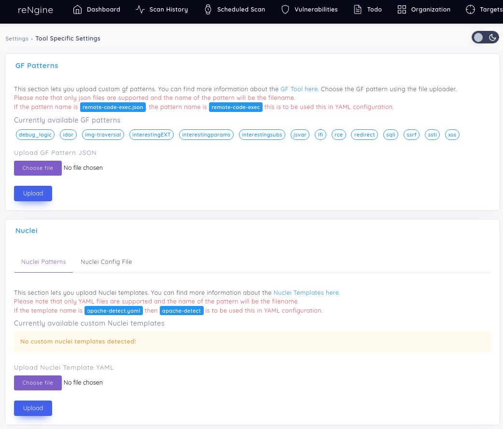
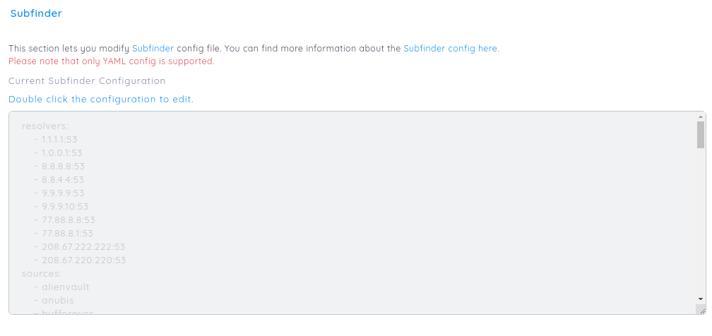

# Tool Settings

You can now upload custom gf patterns, nuclei templated and edit tool configurations directly from UI.

## Uploading custom gf patterns and nuclei templates.

Please visit GF Documentation and Nuclei documentation on what kind of templates are supported.

GF supports json templates while nuclei allows only YAML to be uploaded.

!!! danger "Visit Scan Engine Section"
    Once you have uploaded custom patterns or templates, please visit [Scan Engine](/usage/scan_engine) section on how to use custom patterns and templates.

## Editing tool configurations

Tools like Naabu, Nuclei, Subfinder and amass uses their own configuration files. You can edit the configuration files directly from UI.

On each tool section, double click the textarea, it will be available to edit the configuration.

Please visit tool specific documentation on what kind of configuration is supported.

