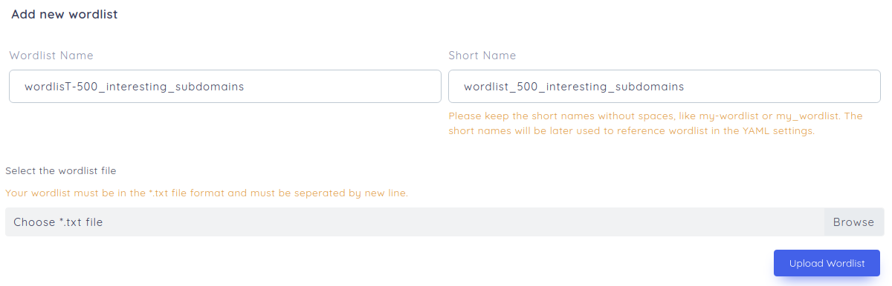

## Wordlist

Tools like [dirsearch](https://github.com/maurosoria/dirsearch) or amass uses wordlist to bruteforce the directories or subdomains. reNgine provides the opton to upload your own wordlists.

### Adding new Wordlist

To upload your Wordlists, on the top navigation menu, click on Engine and then Wordlists. Now click on "Add New Wordlist".

!!! example "Fields"
    * **Wordlist Name**: The Wordlist name for you to identify.
    * **Short Name**: The short name is automatically generated, though you have an option to change it. The short name is an identifier to the config file, that will be used to reference in the **Scan Engine YAML Configuration**.
    * Upload your wordlist in txt file format.

Using the wordlist in **Scan Engine** will be discussed in the [Scan Engine](/usage/scan_engine) section.

!!! tip "Common Wordlists"
    Some of the common wordlists for your scans.
    * [Seclists](https://github.com/danielmiessler/SecLists)
    * [Jason Haddix DNS Enumeration wordlist](https://gist.github.com/jhaddix/86a06c5dc309d08580a018c66354a056)
    * [Jason Haddix Content Discovery wordlist](https://gist.githubusercontent.com/jhaddix/b80ea67d85c13206125806f0828f4d10/raw/c81a34fe84731430741e0463eb6076129c20c4c0/content_discovery_all.txt)

!!! info "Default Wordlist"
    reNgine also has default wordlist called deepmagic top 5000 prefix, which can be referenced in scan engines using `wordlist: default`
